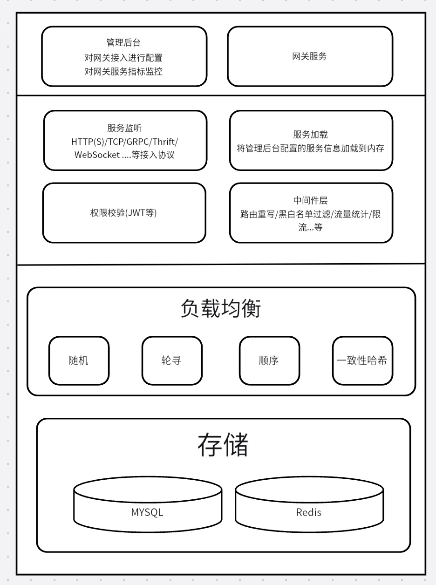

# 简介
## go 实现Gateway网关
## 架构设计

## 已支持功能
### 支持协议
- HTTP
### 支持功能
- 对网关api接入可配置化
- 黑白名单规则校验
- 请求量/QPS等信息可观测
- QPS限流
- 反向代理
  负载均衡支持
- 随机
- 轮训
- 顺序
- 一致性哈希
### 待开发功能
- HTTPS，TCP/UDP，GRPC，WebSocket协议支持
- 熔断，降级功能
- 配置化平台搭建
- 服务权限/授权功能完善
- 日志系统搭建
    - 优雅统一处理日志
    - 收集日志提供查询平台
- 接入注册中心

## BUG
- 服务信息加载到内存只会在服务启动时加载，后续更新配置网关无感知
- QPS等信息定时清楚前一天数据并同步mysql数据

## 说明
后端小萌新，本项目用途个人学习，欢迎您的指点，也欢迎加入我一起